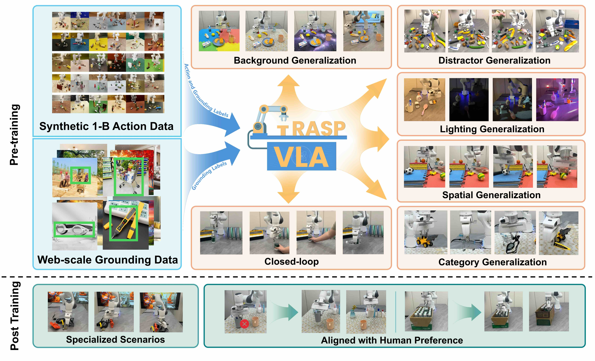
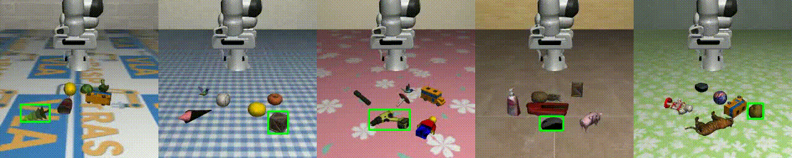
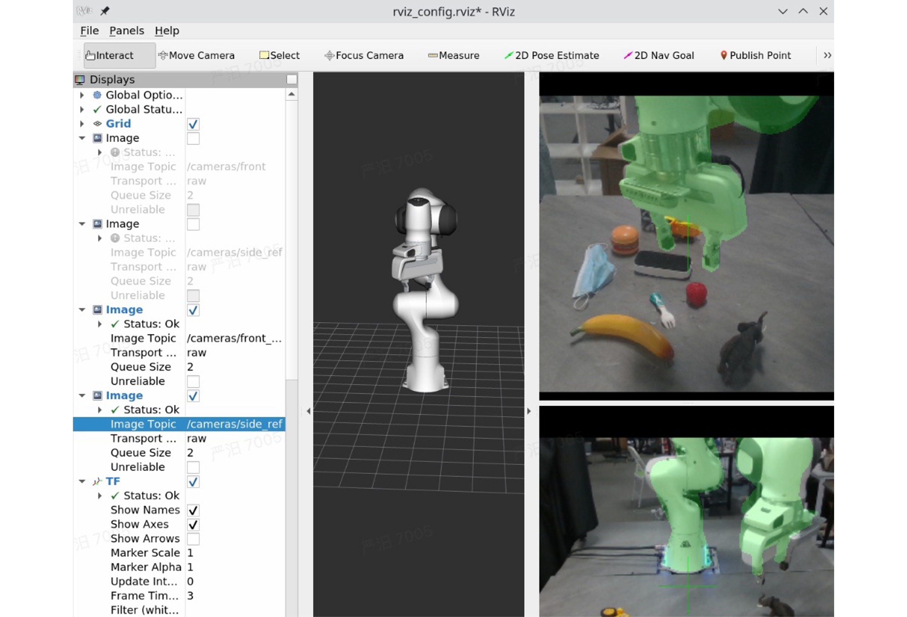

# GraspVLA: a Grasping Foundation Model Pre-trained on Billion-scale Synthetic Action Data

[](https://arxiv.org/pdf/2505.03233)
[](https://pku-epic.github.io/GraspVLA-web/)

[**Model Server**](#model-server) | [**Simulation Playground**](#simulation-playground) | [**Real World Control Interface**](#real-world-control-interface)

We present a cost-effective pretraining paradigm for VLA models using only synthetic data, achieving direct sim-to-real transfer and strong zero-shot generalizability for robotic grasping. Key contributions include:

- **SynGrasp-1B**: a billion-frame synthetic grasping dataset, spanning 240 object categories and 10,000+ objects.

- **GraspVLA**: a VLA model pretrained on SynGrasp-1B that achieves zero-shot generalization to real-world grasping without fine-tuning.

- **Unified CoT Framework**: GraspVLA integrates autoregressive perception and flow-matching-based action generation into a single reasoning process, enabling joint training on synthetic action data and internet-scale semantic data for open-vocabulary grasping.



## Latest Updates
- [2025-07-25] Release the GraspVLA model, [simulation playground](https://github.com/MiYanDoris/GraspVLA-playground) and [real world control interface](https://github.com/MiYanDoris/GraspVLA-real-world-controller).
- [2025-07-19] Release the [supplementary material](https://arxiv.org/pdf/2505.03233).

## Model Server

Please follow the steps below to start the model server. We provide the checkpoint of GraspVLA on both [huggingface](https://huggingface.co/shengliangd/GraspVLA) and [Baidu cloud](https://pan.baidu.com/s/1DOJbKrKzdBcEIrFQ_NcuLw?pwd=6666). GraspVLA achieves 200ms inference latency using ~9GB of GPU memory when running on a single NVIDIA RTX L40 GPU.

### Step 1: Clone the Repository
```bash
git clone https://github.com/PKU-EPIC/GraspVLA
cd GraspVLA
```

### Step 2: Set Up Python Environment
Create and activate a conda environment with the required dependencies, for example:
```bash
conda create -n GraspVLA python=3.9.19
conda activate GraspVLA
pip install -r requirements.txt
```

### Step 3: Launch the Model Server
Run the model server with your desired configuration, for example:
```bash
python3 -u -m vla_network.scripts.serve --path you-path-to-model.safetensors --port 6666
```

#### Required arguments:

- --path — Path to the model.safetensors file.

- --port — Port number on which the server will listen for incoming requests.

#### Optional arguments:

- --compile: Enable model compilation (default: False). Speeds up inference (500ms → 200ms) but adds ~3 minutes to startup time. Recommended for large-scale evaluations (e.g., LIBERO benchmark).

Success: The message `Started server on port <PORT>` indicates the server is ready.

### Offline Test And Visualization

To quickly test GraspVLA without setting up a simulation or real-world environment, use the `offline_test` script. It runs offline inference on pre-recorded requests and compares results. The script saves a comparison image in `visualization`, with our reference output (left) and your model’s output (from the specified port) on the right.

```bash
python3 -u -m vla_network.scripts.offline_test --port <PORT>
```

### Repository Structure

High-level overview of `vla_network` file-tree:

+ `config/` - Contains basic configurations for our model.
+ `data_preprocessing/` - Includes tools for preprocessing raw data into model-ready formats.
+ `model/` - Code for defining and loading the main model structure.
+ `scripts/` - Contains the `serve.py` file that starts a model server and the `offline_test.py` file that performs offline visualization.
+ `type/` - Data type definitions used in our model.
+ `utils/` - Contains some constants used in our model.

## Simulation Playground
We provide a simulation playground for GraspVLA here: [GraspVLA-playground](https://github.com/MiYanDoris/GraspVLA-playground). This repository includes both the evaluation code used for GraspVLA in the [LIBERO](https://github.com/Lifelong-Robot-Learning/LIBERO) benchmark and an enhanced playground environment built on top of it. The playground provides an easy-to-use interface to evaluate GraspVLA across diverse objects, layouts, and environments.


## Real World Control Interface
We provide a [real-world control interface](https://github.com/MiYanDoris/GraspVLA-real-world-controller) for deploying GraspVLA in physical environments. This interface enables:

- Zero-shot evaluation on real-world objects.

- Both blocking and non-blocking control modes.

- Real-time visualization of intermediate COT results, including 2D bounding boxes and 3D grasp poses.



## Citation

If you find this work useful, please cite:

```bibtex
@article{deng2025graspvla,
    title={GraspVLA: a Grasping Foundation Model Pre-trained on Billion-scale Synthetic Action Data}, 
    author={Shengliang Deng and Mi Yan and Songlin Wei and Haixin Ma and Yuxin Yang and Jiayi Chen and Zhiqi Zhang and Taoyu Yang and Xuheng Zhang and Wenhao Zhang and Heming Cui and Zhizheng Zhang and He Wang},
    year={2025},
    eprint={2505.03233},
    archivePrefix={arXiv},
    primaryClass={cs.RO},
    url={https://arxiv.org/abs/2505.03233}
}
```

[](LICENSE)